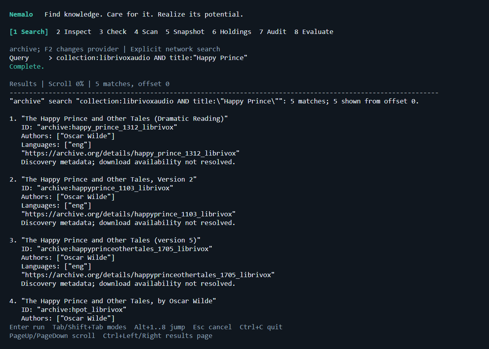

# Nemalo

Find knowledge. Care for it. Realize its potential.

Pronounced **neh-MAH-lo**. The name expresses the intent to acquire and nurture knowledge.

Nemalo is a local digital library and discovery system focused on books, ebooks,
and audiobooks. Humans and agents use one system to find, evaluate, acquire,
verify, ingest, organize, preserve, and access a portable collection. Research
papers, textbooks, and additional sources extend that same library.

Think package-manager discipline for information resources: source catalogs,
explicit selections, dependable transfers, integrity evidence, provenance, local
ownership, and recoverable changes. Existing messy downloads and newly discovered
content enter the same pipeline.

**Go only. Linux-first CLI and TUI, with native macOS and Windows targets.** The CLI,
structured JSON interface, and MCP server will share the same intake and recovery
logic. Agent packaging will follow [Agent Plugins](https://agent-plugins.org/).

## Project status

**Early Go implementation, not a 1.0 release.** Working capabilities are CLI/TUI
Open Library and Internet Archive discovery, Archive item/file evaluation,
read-only folder inventory, optional bounded SHA-256 hashing,
configuration, capability reports, and versioned JSON output. Inventory classifies
filename candidates; it does not establish format validity or malware safety.

`check FILE` adds actual signature/structure checks, size and SHA-256, EPUB
reading-order and text measurements, and optional installed antivirus via `--scan`.
It reports incomplete checks and review findings, without claiming absolute safety.

`library snapshot` records portable byte identities and duplicate locations;
`library list` searches those holdings and optional EPUB metadata; `library audit`
detects changed, missing, added, and unverified files against a selected baseline.
Production downloads, archive extraction, checked publication, mutable catalogs,
journal recovery, audiobook management, and MCP are still planned.
Go was confirmed on 2026-10-08.
The separate [validation harness](docs/VALIDATION.md) acquires a curated collection
of 80 EPUBs, 10 audiobook recordings, and 10 papers into untrusted intake outside
the checkout. This exercises real resources without claiming production ingestion.
The subsequent discovery-validation expansion brings the current external exercise
to 104 resources; its checks and remaining gaps are recorded in the validation guide.
See the [language and stack decision](docs/decisions/0001-language-and-stack.md)
for the Go/Rust comparison and implementation boundaries.

This repository contains Go application code, tests, and verification tooling.
The earlier Python experiment is not part of this repository or its build.

## Build and use

Install Go 1.27.2 or a compatible newer supported toolchain, then:

```sh
go build -trimpath -o bin/ ./cmd/nemalo
go run ./cmd/nemalo tui
go run ./cmd/nemalo doctor --json
go run ./cmd/nemalo search "Jules Verne" --limit 5
go run ./cmd/nemalo search 'collection:librivoxaudio AND title:"Art of War"' --source archive --limit 3
go run ./cmd/nemalo evaluate archive:art_of_war_chinese_1506_librivox --json
go run ./cmd/nemalo inspect ./docs --hashes --json
go run ./cmd/nemalo check /path/to/book.epub --json
go run ./cmd/nemalo check /path/to/book.epub --scan
go run ./cmd/nemalo library snapshot /path/to/books --output /path/to/catalog.json --assess
go run ./cmd/nemalo library list /path/to/catalog.json --query "Verne"
go run ./cmd/nemalo library list /path/to/catalog.json --format epub
go run ./cmd/nemalo library audit /path/to/catalog.json --root /path/to/books
```

`bin/nemalo` (`bin/nemalo.exe` on Windows) is the native executable. The TUI uses
Tab/Shift+Tab to cycle operations and Alt+1..8 to jump directly. Inputs and results
stay with each operation. F2 selects the search provider; F3 explicitly selects
the local read budget; F4 changes the holdings filename-format filter.
Enter runs, Escape cancels, PageUp/PageDown scroll, and Ctrl+C quits. Ctrl+N switches
library form fields; Ctrl+A toggles snapshot health metadata. Ctrl+Left/Right pages
search or holdings results. Holdings start with EPUB filenames; choose all to see
receipts and other material. A filename filter does not certify format validity.
Search sends the query to the selected provider; evaluation sends the selected
Archive item ID. Local inventory/catalog operations are offline. No telemetry or
model service is required. The interface adapts to terminal background/color
capabilities, respects `NO_COLOR`, and requires at least 40 columns and 20 rows.

### TUI examples

Rendered snapshots of the application view using the actual validation catalog
and live Archive results, captured 2026-10-08. These are terminal-frame
renders, not operating-system window captures or mockups. Downloaded content and
private paths are excluded; `catalog.json` is a local copy of the real catalog.




Evaluation shows offered files, declared sizes/checksums, rights/license statements,
and separate access restrictions. Candidate URLs are not downloaded or probed;
DRM, file-level rights, quality, and safety remain unverified. Restricted or uncertain
items/files receive no download URL. See the
[provider decision](docs/decisions/0005-provider-search-and-evaluation.md).

File checks use a private temporary snapshot, at most 256 MiB. EPUBs generally
have no fixed page count, so measured documents/text are reported instead of
invented pages. PDF pages and audio duration are not yet parsed. Antivirus is
optional; its installed cloud/sample-submission policy applies when requested.
See the [assessment decision](docs/decisions/0003-file-health-and-scanners.md).

Catalog snapshots account for all regular files, preserve sources, and never
overwrite. Save catalogs outside the scanned folder in an existing directory.
Assessment metadata is historical evidence, not checked publication or a safety
verdict. Audits always require an explicit root and make no repairs. See the
[catalog decision](docs/decisions/0004-portable-library-snapshots.md) for bounds,
filesystem requirements, and durability limitations.

For configuration precedence, paths, limits, verification, and current boundaries,
see [development and operation](docs/DEVELOPMENT.md). All supported current commands
are listed by `nemalo help`; the production examples below remain a future design.

The design is recorded in:

- [Roadmap and release gates](ROADMAP.md)
- [Architecture, formats, recovery, and dependency policy](docs/ARCHITECTURE.md)
- [Source directory and verified integration constraints](docs/SOURCES.md)
- [MCP and Agent Plugins design](docs/AGENT-INTEGRATION.md)
- [Related-project research and design choices](docs/RESEARCH.md)
- [Real-resource collection and validation boundaries](docs/VALIDATION.md)

## What Nemalo should do

**1.0 focuses on the library and finding things:** dependable discovery and
acquisition, messy-download intake, verified organization, preservation, and access
for ebooks and audiobooks. CLI, JSON, and MCP expose those library capabilities.
Model-assisted analysis, generated knowledge workspaces, and video/topic insight
workflows are post-1.0 work and cannot become prerequisites for the library release.
See the [1.0 scope](ROADMAP.md#version-10-library-and-discovery).

The full lifecycle defines the product from the outset, even when capabilities
ship in different milestones:

| Operation | Product contract |
| --- | --- |
| Discover | Unified search across legitimate book, paper, textbook, and audio sources |
| Evaluate | Compare editions, translations, formats, languages, quality evidence, rights, availability, and DRM restrictions |
| Acquire | Resolve selected assets; manage bounded, resumable transfers and multi-source collections |
| Verify | Assess integrity, structure, malicious-content indicators, provenance, and metadata without safety guarantees |
| Ingest | Apply the same checks to existing folders, subfolders, and supported archives |
| Organize | Maintain searchable metadata, versions, editions, recordings, and careful duplicate handling |
| Preserve | Detect missing/changed assets, recover interrupted operations, and make cleanup reversible |
| Access | Open, retrieve, search, cite, and use actual local content through portable formats |
| Automate | Expose first-class CLI/TUI, JSON/structured APIs, MCP, and agent packaging over shared services |
| Expand | Add providers, formats, metadata standards, and declarative collections through deliberate extension seams |

Initial implementation requirements include:

- Accept explicit download folders, including subfolders and supported nested archives.
- Identify content using signatures, metadata, and stable identifiers.
- Assess format structure, suspicious content, and quality indicators separately.
- Run local antivirus checks and retain their results as separate evidence.
- Organize EPUBs, paper PDFs, and audiobook recordings under distinct policies.
- Detect exact duplicates and preserve potentially different editions for review.
- Preserve alternate formats, uncertain metadata, and incomplete material in review.
- Clean source folders only after their contents have a verified disposition.
- Search public catalogs and send selected downloads through the same intake pipeline.
- Preserve edition, translation, recording, chapter, license, and source details.
- Expose bounded, typed tools for agents without requiring an AI service.

EPUB remains the default ebook format. Non-EPUB ebooks go to review unless the
user enables a PDF policy. Research papers use a separate PDF policy; audiobooks
start with MP3 and M4B. Those policies arrive in staged releases, as described in
the roadmap. Conversion, OCR, playback, and AI narration are separate capabilities.

## Product commitments

- Prepare before use: inspect untrusted material, report scanner coverage and
  missing checks, and preserve uncertain content without making safety guarantees.
- Respect the user's machine: bounded CPU, memory, disk, and network work; visible
  costs and progress; prompt cancellation; no surprise background activity.
- Protect local ownership and privacy: no telemetry, covert reading tracking,
  hidden uploads, or remote crash reporting. Network actions have explicit purposes.
- Keep interfaces direct and accessible: useful help, quiet defaults, clear errors,
  keyboard-friendly workflows, and complete structured output. Simplicity must
  preserve useful capabilities and accessibility.
- Make evidence and recommendations honest: show provenance, uncertainty, selection
  criteria, and coverage gaps. No sponsored ranking, engagement optimization, or
  pressure to acquire more. Users control sources and curation preferences.
- Help people use what they collect: retrieve passages, cite exact editions,
  navigate chapters, and maintain optional local notes, bookmarks, and reading lists.
  A useful collection serves the user's questions and learning goals; download
  counts and collection size are not measures of success.

These are requirements for the product. The architecture and roadmap turn them
into explicit boundaries and acceptance checks; they are not claims of implemented behavior.

After 1.0 and the existing library roadmap priorities, the roadmap adds topic watches
and a local Markdown knowledge workspace: gather permitted information, retain sources,
and optionally build linked summaries, insights, and briefs that stay current.
Processing can use local models, a provider such as OpenRouter, or an agent harness
such as OpenCode. These are native Nemalo capabilities, implemented independently in Go.
Distillr is only a research reference, with no integration, code reuse, or runtime
dependency. See the
[post-1.0 phase](ROADMAP.md#post-10-topic-watches-and-optional-knowledge-processing).

## Intended workflow

```text
Discover -> evaluate -> resolve -> acquire
                                      |
Existing folders and archives ---------+
                                      |
                    Plan -> stage -> verify -> organize
                                      |
                  Local collection + provenance + content access
                                      |
                      Check / preserve / recover
                                      |
                   Optional recoverable source cleanup
```

Inspection must be useful without changing downloads. Importing books must leave
sources intact by default. Cleanup is a separate, explicit action against the
recorded intake plan, and must refuse stale or changed inputs.

## Proposed command interface

These examples describe the full production design. Only `doctor`, basic Open
Library `search`, read-only `inspect`, file-level `check`, `version`, `help`, and `tui` work today;
language/type/provider filters and the other commands below are planned:

```sh
nemalo doctor
nemalo search "Jules Verne" --language fr
nemalo add gutenberg 4791
nemalo search "linear algebra" --type article --source arxiv
nemalo search "Don Quixote" --type audiobook --language es
nemalo add librivox RECORDING_ID
nemalo inspect ~/Downloads/books --json
nemalo organize ~/Downloads/books --library ~/Books
nemalo list --language fr
nemalo show ITEM_ID --json
nemalo open ITEM_ID
nemalo check
nemalo cleanup --run RUN_ID --dry-run
nemalo cleanup --run RUN_ID --apply
nemalo jobs list --json
nemalo mcp serve --transport stdio
```

The planned `doctor` reports archive tools, scanners, signatures, paths, and permissions.
Today's `doctor` reports configuration paths and tool availability, without executing checks.
`inspect` reports what is present without modifying source or library files; any
temporary staging it needs is bounded and reported. `organize` stages and imports
eligible assets under enabled format policies. `cleanup` shows or applies recorded
dispositions from a completed run. Current `check FILE` assesses one file;
library-wide preservation checks remain planned. An
agent must use the same validated plans and configured filesystem scope.

## Catalogs and collection growth

| Collection | Initial source direction |
| --- | --- |
| Classics and multilingual ebooks | Project Gutenberg, Internet Archive, Open Library; then Standard Ebooks |
| Open textbooks and scholarly books | OpenStax, LibreTexts, DOAB, OAPEN |
| Research papers | arXiv, Europe PMC/PMC; OpenAlex search and Unpaywall DOI resolution |
| Audiobooks | LibriVox and permitted Internet Archive audio assets |
| Broader discovery | Regional libraries, children's collections, institutional repositories, OPDS |

Search, downloadable format, and permission to reuse are distinct pieces of
information. A catalog entry is not a promise of a downloadable EPUB. Nemalo should
show the selected edition, language, format, rights information, and source URL
before adding it. It should preserve this provenance in the library catalog.

The [source directory](docs/SOURCES.md) separates researched integrations from
candidates and external reading/borrowing destinations. A large directory does not
mean every site needs a custom adapter. Use documented APIs, allowed feeds, and
publisher-provided assets; preserve rights at the individual asset level.

## What checked means

Each asset needs separate results for format validity, static content findings,
antivirus scanning, metadata quality, and duplicate status. Scanner outcomes must
distinguish no detected threats, detections, failure, unavailability, skipped files,
and scans stopped by limits. A scan exit code alone is insufficient evidence that
every file was examined.

A valid EPUB can have missing text; a valid PDF can contain poor scans; an audio
file can play while chapters are missing. Format checks and antivirus address
different questions. Nemalo reports evidence and uncertainty, not a safety guarantee.

Unscanned or rejected files remain in review and do not enter the default checked
library. Static inspection can still run when a scanner is missing. A temporary
directory and a subprocess are not security sandboxes.

## Platform and dependency direction

The application, tests, and first-party executable tooling will use Go. Start with
the standard library; justify every module by a concrete need, including its
transitive dependencies. The official Go MCP SDK is the planned standards adapter.
Agent Plugins packaging uses manifests and skill text, not another runtime.

ClamAV, Defender, 7-Zip, EPUBCheck, and media/PDF validators are separate, declared
capabilities. Only require a tool for a policy that needs it. Missing tools cannot
silently turn an unchecked file into a checked one. PAR2 is recovery data and stays
accounted for until verification or repair is explicitly supported.

Library and review directories are user-selected. Linux configuration, state, and
cache locations follow XDG conventions; macOS and Windows use appropriate platform
directories. No fixed drive letter, Downloads folder, or home-directory scan is
part of the production default.

## Development and verification

Run the same checks locally and in native CI:

```sh
go run ./cmd/verify
go test -race ./...
```

CI must fail on formatting differences, static-analysis errors, test failures, or
coverage below 80%. Native Linux/macOS/Windows runs, crash-recovery fixtures,
scanner skip cases, vulnerability checks, MCP interoperability, and release-binary
smoke tests are release gates. Test destructive paths individually even when total
coverage already passes.

`verify` enforces formatting, build, vet, pinned Staticcheck, at least 80% aggregate
statement coverage across all first-party packages, and govulncheck. Race tests need
a native C compiler; release builds use `CGO_ENABLED=0`.

## License

Nemalo is open source under the [Apache License 2.0](LICENSE). Third-party sources
and downloaded content retain their own licenses and access restrictions.
