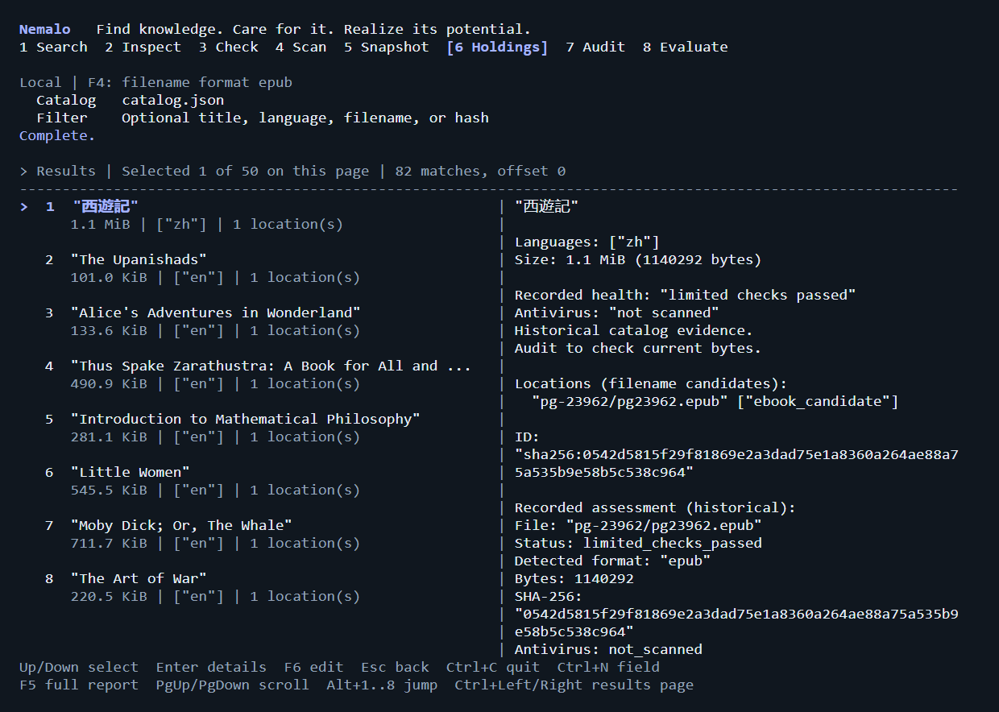

# Nemalo

**Find knowledge. Care for it. Realize its potential.**

Nemalo is an open-source, local-first library and discovery system for books,
ebooks, and audiobooks, with research papers and textbooks extending the same
collection. Find resources, evaluate sources, and care for a portable library
under your control. Pronounced **neh-MAH-lo**: acquire and nurture knowledge.

Built in Go. CLI and TUI first. Linux, macOS, and Windows. No telemetry or required
AI service. Future agent interfaces will use the same application services.

## Status

**Early development, not 1.0.** Available today:

- Search Open Library and Internet Archive; evaluate Archive item/file metadata.
- Inventory explicit folders; check file structure, size, hashes, and EPUB text
  measurements, with optional installed antivirus.
- Save portable catalog snapshots, browse holdings, and audit changed/missing files.
- Use CLI, versioned JSON, or an interactive terminal interface.

Production downloading, archive intake, checked publication, recovery journals,
reader/player handoff, complete audiobook management, and MCP are planned.
File checks report limited evidence, never a safety or completeness guarantee.
See [current capabilities and limits](docs/DEVELOPMENT.md) and the [roadmap](ROADMAP.md).

## Quick start

With Go 1.27.2 or a compatible supported toolchain:

```sh
go build -trimpath -o bin/ ./cmd/nemalo
go run ./cmd/nemalo tui
go run ./cmd/nemalo search "Jules Verne" --limit 5
go run ./cmd/nemalo check /path/to/book.epub --json
```

The binary is `bin/nemalo` (`bin/nemalo.exe` on Windows). Run `nemalo help` for
commands. Local inventory and catalog operations are offline; explicit searches
send queries to the selected provider. Sources are preserved.



Application-view render using the external validation catalog, not a mockup or an
OS window capture. See [terminal guide and discovery view](docs/TUI.md).

## Documentation

| Guide | Contents |
| --- | --- |
| [Product contract](docs/PRODUCT.md) | Vision, commitments, intended workflows, and format policies |
| [Roadmap](ROADMAP.md) | Milestones, release gates, and implemented versus planned work |
| [Operation and development](docs/DEVELOPMENT.md) | Commands, configuration, bounds, safety limits, and verification |
| [Terminal guide](docs/TUI.md) | Navigation, browsing, keyboard shortcuts, and screenshots |
| [Architecture](docs/ARCHITECTURE.md) | Shared services, data protection, recovery, and decisions |
| [Sources](docs/SOURCES.md) | Provider directory, rights, and integration constraints |
| [Agent integration](docs/AGENT-INTEGRATION.md) | Planned MCP and Agent Plugins boundaries |
| [Validation](docs/VALIDATION.md) | External 104-resource collection, evidence, and remaining gaps |
| [Research](docs/RESEARCH.md) | Evaluated patterns and primary references |

Contributing: read [AGENTS.md](AGENTS.md), then run `go run ./cmd/verify` and
`go test -race ./...` (race checks require a native C compiler).

Licensed under [Apache 2.0](LICENSE). Downloaded content retains its own rights.
